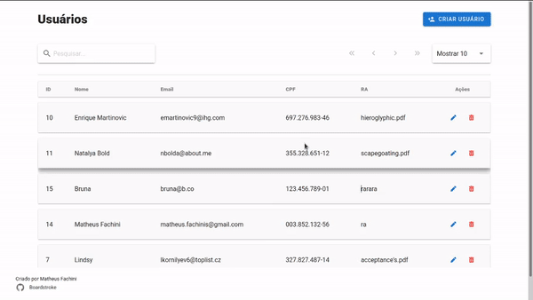

# Aplicação de cadastro de alunos

## Inicializar a aplicação
  Para inicializar o client-side `cd client && npm run serve`. Habilitará a porta 8080

  Para incializar o server-side `cd server && npm run start`. Habilitará a porta 3000.

  O backend possui as opções de desenvolvimento e teste além da produção. O ambiente de desenvolvimento adiciona 100 usuários a tabela para interação do desenvolvedor. Basta rodar o comando `npm run start:development`.

  O ambiente de teste é incializado com o comando `npm run start:test` e para rodar os testes implementados é necessário rodar `npm run test`.

## Frontend

  Utilize as ferramentas vue, com o plugins vuetify, vue-router, sass e finalmente v-mask

### Telas:
  A tela inicial contém diversas funcionalidades:

  * Pesquisa
  * Paginação
  * Excluir usuários
  * Selecionar usuários para editar

  O componente de paginação habilita o usuário a navegar na tabela de indexação na parte superior da tabela.

  As funcionalidades de editar e excluir estão habilitadas como ações na tabela. Ao excluir um elemento é enviado uma solitação a API, ao receber STATUS 204 filtramos a lista de usuarios para remover o elemento excluído, caso um erro acontece durante a operação.

  

  A funcionalidade de pesquisa, habilita o usuário a pesquisar em qualquer um dos campos em tempo rendenização.

  

  O cadastro possui quatro campos obrigátorios. O usuário passa por uma dupla verificação, uma diretamente no campo enquanto ele digita e após isso, uma verificação feita pela api, para verificar se os campos já não estão cadastrados por outro usuário e se estão completos. Dependendo da resposta da api será mostrado um snackbar informando o erro ou sucesso da operação.

  

  A interface de edição é acessada através da tabela através das ações de um usuário. O usuário é redirecionado a outra página onde ele tem acesso a todos os campos, porém podendo editar apenas o nome e email. Após a a finalização da operação o usuário é submetido pelas mesmas verificações apresentadas no cadastro.

  

## Backend

  Utilizei o framework *express* para o backend e o framework *sequelize* para tratar o banco de dados de maneira relacional. Com o sequelize utilizei schemas para a verificação dos dados recebidos para a API.

### Endpoints

  | Routas | Verbo | Parâmetros | Resposta | Descrição |
  |--------|-------|------------|----------|----------|
  | api/users| GET |            | Array    | Retorna todos os usuários cadastrados (200)
  | api/users/:id | GET |        | Objeto   | retorna um usuário com id= (:id) (200)
  | api/users | POST | nome (obrigátorio), email (obrigátorio), cpf (obrigátorio), registro_academico (obrigátorio) | Objeto | Retorna o usuário (201)
  | api/users/:id | PATCH | nome (opcional), email (opcional)  | {} | Atualiza os campos fornecidos do usuários com id = (:id). Resposta não possui corpo (204)
  | api/users/:id | DELETE | | {} |  Deleta o usuário que possui o id = (:id).

  ## Material de refêrencia:

  Documento de refêrencia para construção da api: [Microsoft API Guidance](https://docs.microsoft.com/en-us/azure/architecture/best-practices/api-design)

